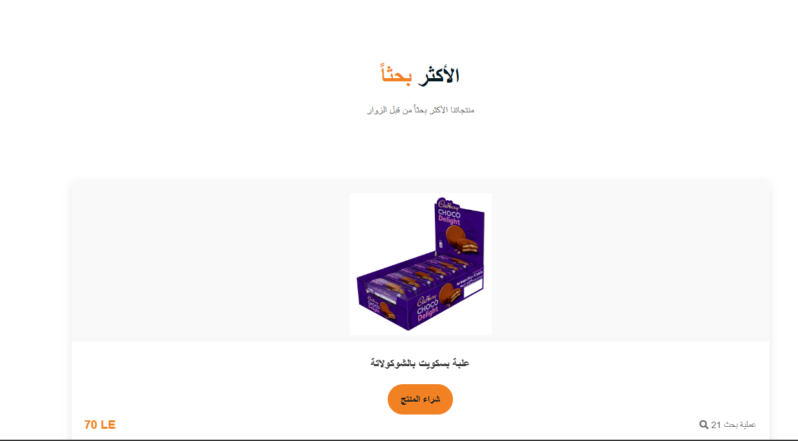
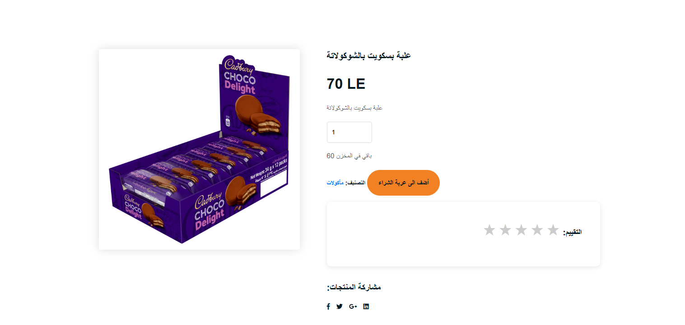
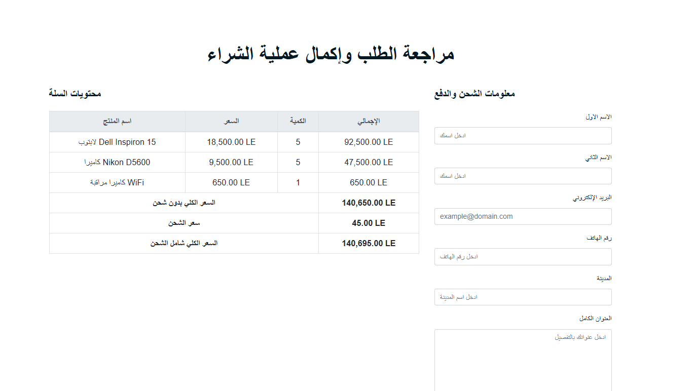
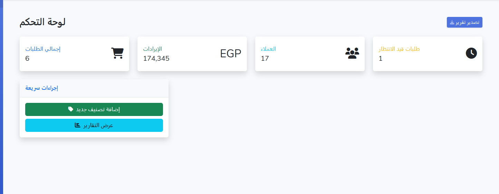
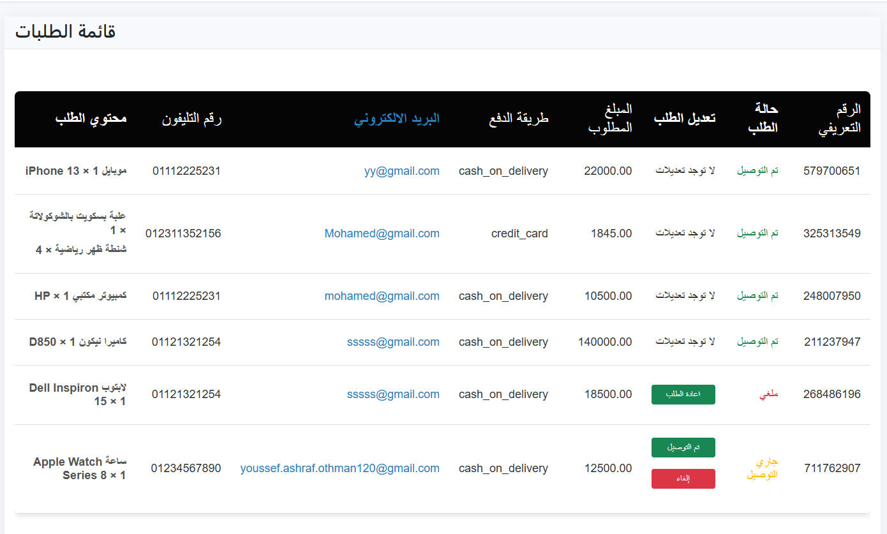

# 🛒 JO-STORE – Laravel E-commerce Website

A full-featured e-commerce web application built with Laravel. The project includes a custom admin dashboard, user-friendly shopping experience, and secure online payments.

## ✨ Live Demo

Check out the live version of the project here:  
🔗 [https://jo-store-production.up.railway.app/](https://jo-store-production.up.railway.app/)

## 🔥 Features

- 🛍️ **Product Management**: Categories, images, prices, stock quantity, and more.
- 👤 **User Profiles**: Editable profile with profile picture upload.
- 🛒 **Shopping Cart System**: Real-time cart updates, quantity adjustments, and removal.
- 💳 **Online Payment Integration**: Secure checkout with payment gateway.
- ⭐ **Product Reviews**: Users can leave ratings and written feedback.
- 🎯 **Related Products**: Recommendations displayed on product pages.
- 🧑‍💻 **Admin Panel**: Full control over products, orders, users, and website settings.
- 📦 **Order Management**: Track and update order statuses from the dashboard.

## 🛠️ Built With

- **Backend**: Laravel 12+
- **Frontend**: Blade, Bootstrap 
- **Database**: MySQL 
- **Authentication**: Laravel Breeze / Jetstream (optional)
- **Payment Gateway**: [Paymob]

## 🚀 Getting Started

1. Clone the repository:
   git clone https://github.com/youssef-ashraf-othman/laravel-ecommerce-store.git
   cd your-repo-name
   

2. install dependencies:
   composer install
   npm install && npm run dev

3. Configure your database in .env, then run migrations:
   php artisan migrate --seed

4. Run the server:
   php artisan serve

## 📸 Screenshots

### Store:

Admin panel:

## 🙋‍♂️ Author
Youssef Ashraf

www.linkedin.com/in/youssef-ashraf-7a8721249 | youssef.ashraf.othman120@gmail.com